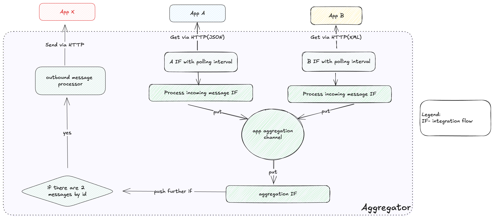

## General details
### About the application
The primary objectives of the service encompass the solicitation and consolidation of computational outcomes from third-party entities such as A, B, and others. Subsequent to the data collection and aggregation processes, the amalgamated outcome is conveyed to service X.

### Application architecture

## How To?
### Build the project locally:
To build jar in project root directory:
`./gradlew clean build`.   
Note: command will execute code style verifications, unit tests, integration tests

### Build a docker image:
**Option 1 - build image using Spring boot Gradle plugin:**
1. Using spring-boot build plugin: `./gradlew bootBuildImage --imageName=myorg/aggregator`.
2. To start app use command: `docker run -p 8090:8090 -t myorg/aggregator`.

**Option 2 - Build app insight docker:**
1. Using docker script build image insight docker: `docker build -t myorg/aggregator:0.0.1 .`.
2. To start app use command: `docker run --name aggregator -p 8090:8090 -d -t myorg/aggregator`.
